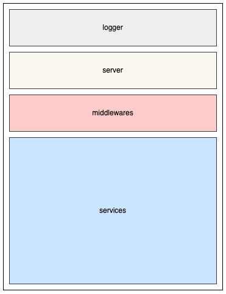

# Configuration

The gateway is fully configurable using a `config.yaml` file.

## Indicating Config File Location

Set the `GATEWAY_CONFIG` environment variable to the parent directory of your `config.yaml` file.

## Configuration File Organization

The configuration is split into different parts:

<figure markdown="span">

</figure>

* **logger**: Configures the logger for the gateway.
* **server**: Configures the gateway server.
* **middlewares**: Holds global middleware configurations that can be shared between services.
* **services**: Manages the configuration for each service.
